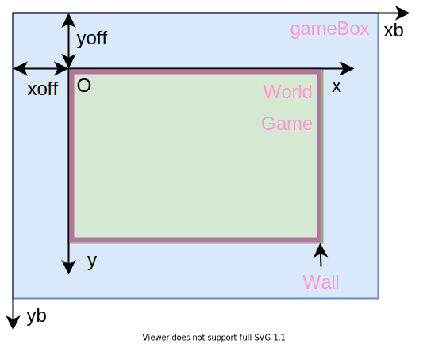
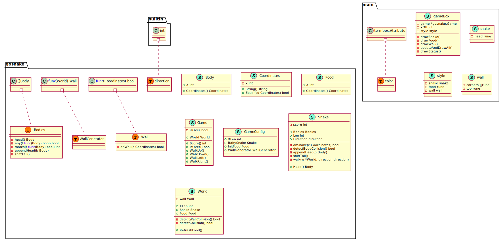

## Gosnake 🐍
A classic snake game implemented in golang.


### Installation
Install and update this package with `go get -u github.com/sinomoe/gosnake`.


### Usage

1. Construct an initial baby snake and food pair.

1. Construct `WallGenerator`, a `WallGenerator` is a function which receives a `World` and return a `Wall`, `Wall` is function which receives a `Coordinates` and return whether that coordinates is on the wall. Here is the `DefaultWallGenerator`.

   ```go
   DefaultWallGenerator = func(w World) Wall {
   		return func(c Coordinates) bool {
         x = c.x
         y = c.y
         // this is a rectangle
   			if x <= 0 || y <= 0 || x >= w.XLen || y >= w.YLen {
   				return true
   			}
   			return false
   		}
   }
   ```

   The means of a `WallGenerator` is to return an function(`Wall`) which is binded with `World` boundary. So we can restrict the reachable area by changing the if condition in L5 of above code. 

1. Construct `GameConfig` , call `GameInit(config)` and return a `*Game` instance.

1. Call `G.WalkUp()`, `G.WalkDown()`, `G.WalkLeft()`, `G.WalkRight()` according to the key inputed.

1. Check game status by `G.Score()` and `G.IsOver()`.

1. If `G.IsOver()` returns `true` , the game is over.


### Example
For example of what can be done take a look at `demo/demo.go`. You can try it with go run: `go run demos/demo.go`.

### Design

#### coordinates



The outer coordinates of x<sub>b</sub>, y<sub>b</sub> denotes the coordinates of the `gameBox` in `demo/demo.go`, in this implementation, x<sub>b</sub>, y<sub>b</sub> is the coordinates of [termbox-go](https://github.com/nsf/termbox-go). x<sub>off</sub> and y<sub>off</sub> denotes the offset value of the game coordinates with respect to the gameBox coordinates.

The inner coordinates of x, y denotes the coordinates of the `Game` or `World` in `snake.go`; the red part of the picture denotes the Wall which is the border of the game world; the green part denotes the reachable area for the snake.

#### UML




### License
MIT