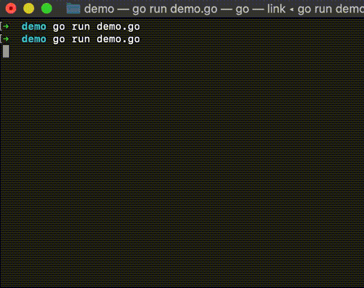

## gosnake
A classic snake game implemented in golang.

### Installation
Install and update this package with `go get -u github.com/sinomoe/gosnake`.

### Example
For example of what can be done take a look at `demo/demo.go`. You can try it with go run: `go run demos/demo.go`.

### Design

### License
sinomoe@MIT